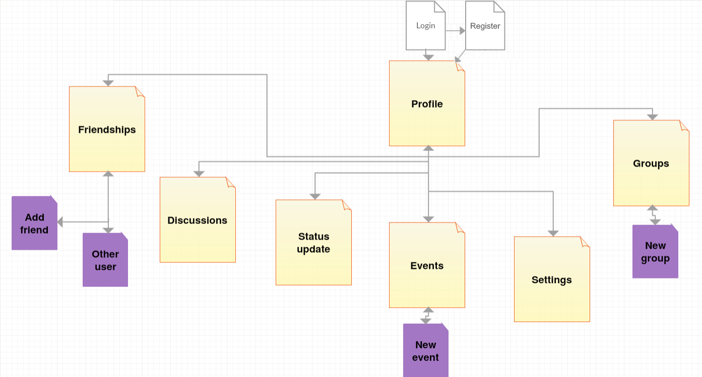

**Welcome to the home of your group's BWA course project code and documentation!**

This file is where your group writes your project plan/project report.

When you write it, you must use Markdown. [Documentation for GitLab Flavored Markdown (GFM)](https://docs.gitlab.com/ee/user/markdown.html).

# Initial project plan document
The headers that must be present in this document are shown here. They were copied here from the course project assignment document.

For instructions on what to add under these headers, see the course project assignment document, [Appendix 2: Initial project plan document](https://docs.google.com/document/d/1iJ4z8dQzUWht0ABX18RXa5Rp8hY76vcMJvBbxODs3PE/edit?usp=sharing#heading=h.m6xhgmo8x8lz)

## Course project group information
The name, student number, and TUT email for each group member:
 
Matias Mane, matias.mane@student.tut.fi, 267034 

Henrik Sillanpää, henrik.sillanpaa@student.tut.fi, 224507

Lauri Varjo, lauri.varjo@student.tut.fi, 252869

Group name: Velhot

GitLab repo URL: https://course-gitlab.tut.fi/bwa-2018/bwa-group040.git

## Must have features
The must have features will be implemented in the following order:

1.	Document
2.	User model
3. 	Profile page
4.	Settings
5.	Friendships
6.	Events
7.	Discussion

## Planned +2 features
We are planning to implement the following +2 features in our course project:

1. Exceptional quality of project plan document 
2. Groups
3. PostgreSQL 
4. Email validation 
5. Reset password 

The features will be implemented in the numbered order above, starting with the exceptional quality of this document.

## Pages and navigation

The high level view of our website is shown in the image below.

## Technological considerations

### Needed Django models and their attributes
The needed models and their attributes will be:

**User**  
Description: The model for a user in the website. Includes personal information of the user.  
Attributes: real name, username, email, phone number, address    
Connections: friendship, event, discussion, group, message, status update    

**Event**  
Description: The model for an event that a user can create and others can join.  
Attributes: name, description, category, duration, place, participants  
Connections: discussion, user  

**Discussion**  
Description: The model for a discussion between two or more users.  
Attributes: participants  
Connections: message, user  

**Group**  
Description: The model for a group that a user can create and others can join.  
Attributes: members, posts  
Connections: discussion  

**Friendship**  
Description: The model for a friendship between two users.  
Attributes: status, users  
Connections: user  

**Message**  
Description: A simple model for a user-made message in the system.  
Attributes: text, author, date and time  
Connections: user  

**Status update**  
Description: A model for the status updates in a user’s profile.  
Attributes: text, author, date and time  
Connections: user  

### URLs
In the website we will use the following URLs:

Login page: domain  
Profile Page: /user_name  
Settings Page: /user_name/settings  
List of friends: /user_name/friends  
Friend requests: /user_name/requests  
List of discussions: /user_name/discussions  
New discussion: /discussions/create  
One particular discussion: /discussions/discussion_id  
List of events: /events  
New event: /events/create  
One particular event: /events/event_id  

### Needed Django views and templates
The following views will be needed in the website:

**Login**  
Function on the system: The frontpage of the website.  
When called: This view is called when the user enters the page for the first time or after a session has ended. The page offers registeration for new users and login for users who have already registered.
Parameters: -  
Output: Renders login page.  

**Register**  
Function on the system: The page where a new user can register.  
When called:  The view is called when a user clicks "register" in the login page.  
Parameters:-  
Output: Renders register page.  

**Settings**  
Function on the system: The page where user settings can be edited etc.  
When called: The view is called when the user chooses the settings icon in the navigation bar.  
Parameters: username  
Output: Renders settings page.  

**Friendships**  
Function on the system: Shows all the friendships the user has  
When called: The view is called when the user chooses the friendships icon in the navigation bar.  
Parameters: username  
Output: Renders friendship page.  

**Profile**  
Function on the system: The actual mainpage of the website after loggin in.  
When called: This is the view when you have been logged in from the Login page. You can call this icon from any view.  
Parameters: username  
Output: Renders profile page.  

**Discussions**  
Function on the system: This page enables the discussions in the website. In the view the user can see all the discussions and start new ones.  
When called: The view is called when the user chooses the discussion icon on the navigation bar.  
Parameters: username  
Output: Renders discussion page.  

**Events**
Function on the system: On this page you can set an event or participate in an event.  
When called: This view is called when the user is making an event or the user is participating.  
Parameters: username, discussion   
Output: Renders event page.  

**Groups**  
Function on the system:  You can create a group with specific friends and discuss with them privately.   
When called: This view is called when the user wants to discuss with the group or read messages.  
Parameters: username, discussion, friendship  
Output: Renders group page.  

### Heroku deployment

## Testing
The testing timetable will become clearer once we get the project rolling and start to implement the parts of the website. We are not planning to do the “Thorough testing using Django test” but if we still have time later during the project we will do it. We will mainly test the sites functionality and will do the verification of the code using a code tester. The UI and its usability will be evaluated using heuristic evaluation. 

## Project timetable and division of work

We will start first together on the features and afterwards we will divide them accord-ingly. We all promised to be working on this project at least twice per week for a min-imum of 2h per session. The first hours of work will be done together in meetings.
Matias will be the one creating the GitLab issues and assign them and will cre-ate it before our meeting on the 6th of November.     

>>>
_`The Django project in this repo (bwa2018djangoproject), was created for the groups using Heroku Django Starter Template. The information about it left here for educational purposes. The groups are free to remove this text and all the text below it from this file.`_
# Heroku Django Starter Template

An utterly fantastic project starter template for Django 2.0.

## Features

- Production-ready configuration for Static Files, Database Settings, Gunicorn, etc.
- Enhancements to Django's static file serving functionality via WhiteNoise.
- Latest Python 3.6 runtime environment.

## How to Use

To use this project, follow these steps:

1. Create your working environment.
2. Install Django (`$ pipenv install django`)
3. Create a new project using this template

## Creating Your Project

Using this template to create a new Django app is easy::

    $ django-admin.py startproject --template=https://github.com/heroku/heroku-django-template/archive/master.zip --name=Procfile helloworld

(If this doesn't work on windows, replace `django-admin.py` with `django-admin`)

You can replace ``helloworld`` with your desired project name.

## Deployment to Heroku

    $ git init
    $ git add -A
    $ git commit -m "Initial commit"

    $ heroku create
    $ git push heroku master

    $ heroku run python manage.py migrate

See also, a [ready-made application](https://github.com/heroku/python-getting-started), ready to deploy.

## License: MIT

## Further Reading

- [Gunicorn](https://warehouse.python.org/project/gunicorn/)
- [WhiteNoise](https://warehouse.python.org/project/whitenoise/)
- [dj-database-url](https://warehouse.python.org/project/dj-database-url/)

>>>
